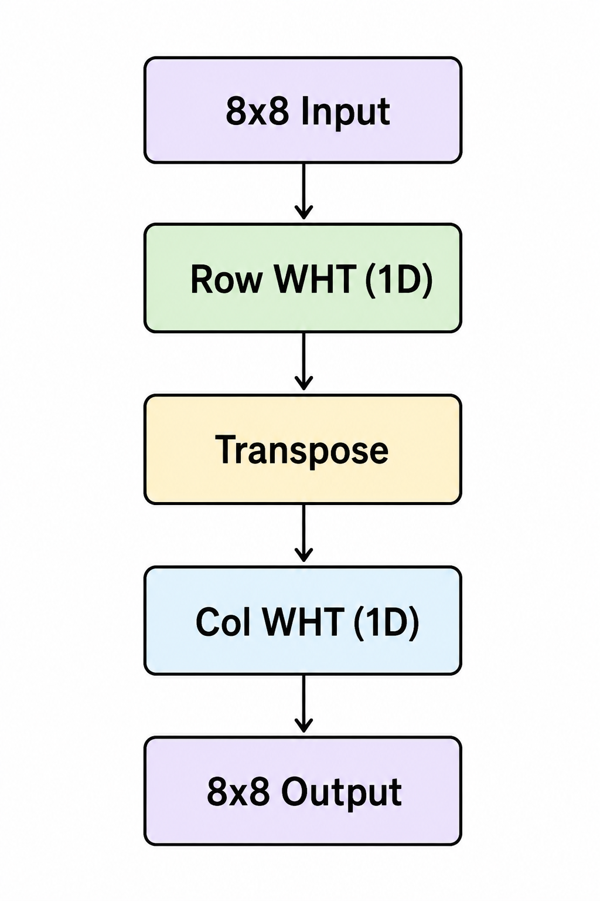
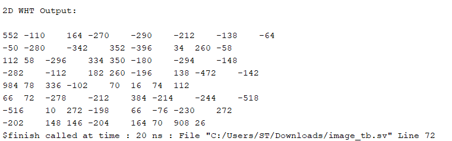
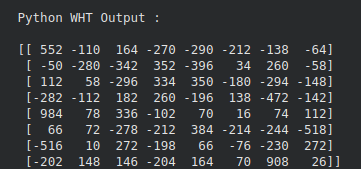
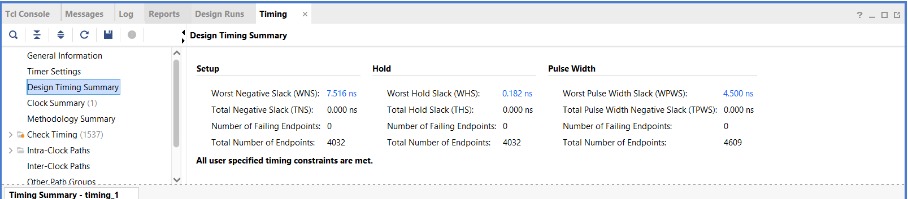
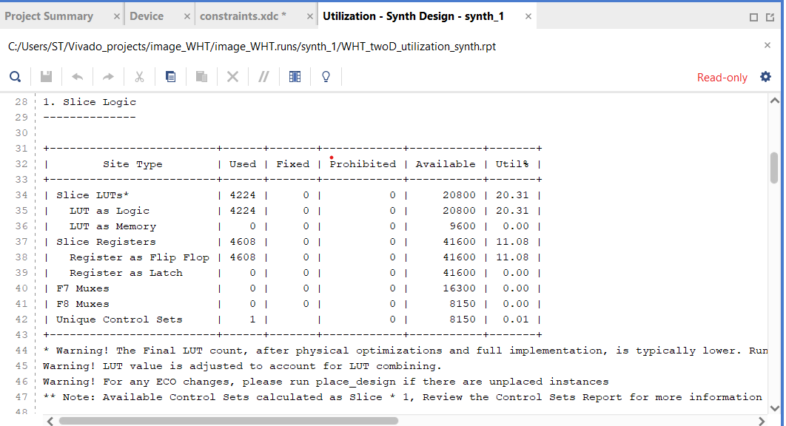
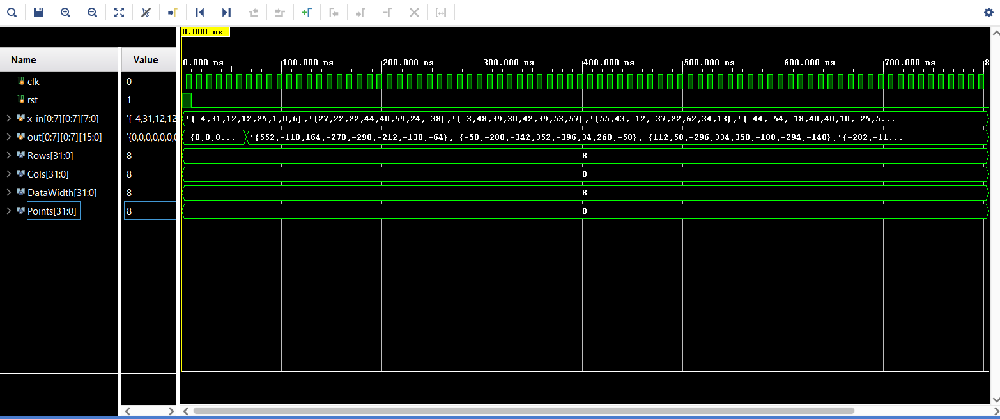

# Pipelined-2D-Walsh-Hadamard-Transform-Accelerator-SystemVerilog
SystemVerilog implementation of a pipelined 8×8 2D Walsh–Hadamard Transform using a multi-stage butterfly architecture. The design is synthesized and timing-closed in Vivado (~400 MHz estimated) and verified against a Python reference model using real image inputs.

## Overview
### What is Walsh-Hadamard Transform (WHT)?
WHT is a non-sinusoidal transformation technique which splits/decomposes the signal into a set of basis functions. These basis functions are called "Walsh functions" and take the values of +1 or -1 only. These functions
are thus in the form of a rect/square waveforms.

### Why use WHT?
WHT is very useful for signal processing applications and is very effective particularly in image processing. The 2D image of a standard size (say for ex. 512x512 pixels) can be split into individual 8x8 or 16x16 pixel sections
(can be other pixel values also but generally used ones are listed) and transformed to Walsh functions. Main advantage is that WHT takes very less bandwidth and storage space as it uses only real addition and subtraction operations
on the operands.

### What is implemented here?
A pipelined parameterized 2D WHT module comprising of individual butterfly PEs (Processing Elements), stages module and the 1D WHT block; thus making it a modular design as well. The 2D module was then synthesized using AMD Vivado and
the resource usage and timing numbers were determined.

## Architecture
The 1D WHT was designed using the butterfly PEs (which are pipelined to have a 1 cycle latency) and the stages module used to instantiate these PEs in a systematic manner. The 1D WHT was then applied to the various rows of the 
2D matrix obtained from a real image. The matrix of the transformed values from the rows were then transposed and another 1D WHT was applied to the columns of the transposed matrix thus finally giving the 2D WHT matrix. The number of stages 
is determined by taking the log2(N) where N = number of points/elements in the 1D array.
The structure used is described below by the flow chart:

  

## Design Details
1. The butterfly PE forms the core computation of WHT and it computes the add and sub operation between 2 real values. 
2. As each add and sub operation requires +1 bit than the operands, each stage output in the WHT increases by 1 bit and the register width mush be large enough to accommodate this bit-growth over multiple stages.
3. Each stage is registered as a result of the pipelining used in the butterfly PE and thus there is a 1 cycle latency between inputs and obtained outputs.

### Why pipelining?
Even though the butterfly PE's operations are not heavy combinational paths, for timing critical systems and passing timing constraints, pipelining is required. A positive slack is obtained as is demonstrated by the timing
reports in the "Results" section which is encouraging enough to have a ~400MHz clock frequency.

## Verification
1. Basic sanity verification in SystemVerilog for 2D WHT module

### Python Verification using real images
Python verification upon a section of a real image (the image used here was the standard Baboon image used widely in image processing research) and the decomposed image values were fed as stimulus to the SystemVerilog 2D WHT design.
The image values were also applied to WHT using the hadamard transform function obtained from the scipy.linalg library.
The results obtained from the actual python verification and the SV stimulus applied to 2D WHT design were compared and the obtained results matched perfectly thus confirming the proper working of the design.
The results from each of them are shown as below :
<table>
  <tr>
    <td align="center"><b>SystemVerilog Output</b></td>
    <td align="center"><b>Python Output</b></td>
  </tr>
  <tr>
    <td align="center">
      
    </td>
    <td align="center">
      
    </td>
  </tr>
</table>

The RTL output matches the Python reference output (unnormalized WHT).

## Results
The result numbers obtained from synthesis and constraints applied are as follows : (All results are obtained using AMD Vivado tool)
1. LUTs: ~4.2K  
2. FFs: ~4.6K  
3. WNS: +7.5 ns  
4. Estimated Fmax: ~400 MHz

The reports are as shown below :

  

<em>Timing summary (setup/hold slack)</em>

  

<em>Resource utilization (LUTs and registers)</em>

  

<em>Simulation waveform</em>

## How to run
Run simulation in Vivado to obtain the waveform.
Run synthesis and obtain the corresponding resource usage report.
Include constraints and run synthesis to obtain the timing reports.

### Note :
The design does NOT simulate well when open source tools are used. During development, I encountered limitations with open-source simulators such as Icarus Verilog and Verilator, particularly in handling unpacked arrays and certain SystemVerilog constructs used in this design. This led to multiple compilation issues and required several iterations to debug and isolate the root cause.
These challenges highlighted the differences in SystemVerilog support across tools. The design was ultimately validated using Vivado XSim, which provides more complete support for the constructs used.

## Limitations
1. No normalization in the WHT outputs
2. The stage module handles 8 point inputs only due to much difficulty faced while attempting to completely parameterize the module. However it can be easily extended to 16 points by adding an instantiation of the butterfly PE.
Much difficulty isnt faced using this approach as the design originally was intended to be used on 8x8 matrices itself.
3. The design assumes powers-of-2 size as most of the general matrices used have powers-of-2 number of elements.

